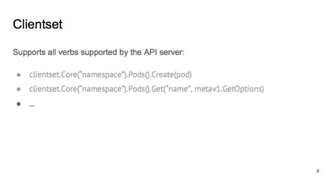

# API列表
# 二次开发
##  访问集群的方式

###  client-go 
项目地址： https://github.com/kubernetes/client-go
我们先看一下 client library 的内容。它主要包括各种 clients：**clientset、DynamicClient 和 RESTClient**。还有帮助你写 Controller 时用到的 utilities：**Workqueue 和 Informer**。

我们先看一下 kube－controller 的大致结构，典型的 controller 一般会有 1 个或者多个 informer，来跟踪某一个 resource，跟 APIserver 保持通讯，把最新的状态反映到本地的 cache 中。只要这些资源有变化，informal 会调用 callback。这些 callbacks 只是做一些非常简单的预处理，把不关心的的变化过滤掉，然后把关心的变更的 Object 放到 workqueue 里面。其实真正的 business logic 都是在 worker 里面， 一般 1 个 Controller 会启动很多 goroutines 跑 Workers，处理 workqueue 里的 items。它会计算用户想要达到的状态和当前的状态有多大的区别，然后通过 clients 向 APIserver 发送请求，来驱动这个集群向用户要求的状态演化。图里面蓝色的是 client-go 的原件，红色是自己写 controller 时填的代码。

先讲最常见的 Clientset，它是 k8s 中出镜率最高的 client，用法比较简单。先选 group，比如 core，再选具体的 resource，比如 pod 或者 job，最后在把动词（create、get）填上。

clientset 的使用分两种情况：集群内和集群外。

集群内：将 controller 容器化后以 pod 的形式在集群里跑，只需调用 rest.InClusterConfig()，默认的 service accoutns 就可以访问 apiserver 的所有资源。

集群外，比如在本地，可以使用与 kubectl 一样的 kube-config 来配置 clients。如果是在云上，比如 gke，还需要 import Auth Plugin。

对于其各种options的讲解， 如Get, List, Watch, Update, Patch, Delete的讲解， 可以参考 [使用 client-go 控制原生及拓展的 Kubernetes API](https://my.oschina.net/caicloud/blog/829365)

现在讲一下另外一种 client，叫做 dynamic client。

dynamic client 用法比较灵活。因为你可以任意设置要操作的 resource。它的 return value，不是一个 structure，而是 map[string]interface{}。如果一个 controller 需要控制所有 API，比如 namespace controller 或者 garbage collector，那就用 dynamic client。使用时可以先通过 discovery，发现有哪些 API，再通过使用 dynamic client access 所有的 api。dynamic client 也支持 third party resources。

dynamic client 的缺点是它只支持 JSON 一种序列化。而 JSON 的效率远远低于 proto buf。

现在我们讲一下 rest client。

Rest Client 是 client 和 dynamic client 的基础。属于比较底层的，跟 dynamic client 一样，你可以使用它操作各种 resource。支持 Do() 和 DoRaw。

相比 dynamic client，支持 protobuf 和 json。效率会比较高。

但是问题就是，如果你要 access third party resource，需要自己写反序列化，不能直接 decode 到 type。在 demo 里会进行演示。

现在我们讲 informer，它的 input 其实就两个，一是要 list function 和 watch function，二是你要给 informer 提供一些 callback。informer 跑起来后，它会维护 localstore。你之后就可以直接访问 localstore，而不用跟 APIserver 通讯。提高一些 performance。

使用 informer 的好处一个是性能比较好，还有一个是可靠性。如果有 network partition，informer 后会从断点开始继续 watch，它不会错过任何 event 的。

Informer 也有一些 best practice，第一点，在 controller run 之前，最好等这些 informer 都 sync 了（初始化）。这样做，一是可以避免 controller 初始化时的 churn：比如 replica set controller 要 watch replica set 和 pod，如果不 sync 就开始 run，controller 会以为现在没有任何 pod，会创建很多不必要的 pod，之后还要删除。二来就是会避免很多很诡异的 bug。我在写 garbage collector 的时候就遇到过不少。

另外 informer 提供的 localcache 是 read-only 的。如果要修改，先用 DeepCopy 拷贝出来，否则可能有 read-write race。并且你的 cache 可能是和其他 controller 共享的，修改 cache 会影响其他 controller。

第三个要注意的地方就是，informer 传递给 callbacks 的 object 不一定是你所期待的 type。比如 informer 追踪所有 pod，返回的 Object 可能不是 pod，而是 DeletedFinalStateUnknown。所以在处理 delete 的时候，除了要处理原来跟踪的 object，还要处理 DeletedFinalStateUnknown。

最后要讲一下的就是，informer 的 resyncoption。它只是周期性地把所有的 local cache 的东西重新放到 FIFO 里。并不是说把 APIserver 上所有的最新状态都重新 list 一遍。这个 option 大家一般都是不会用到的，可以放心大胆地把这个 resync period 设成 0。

最后再讲一下这个 workqueue。

其实主要是为了可以 concurrent processing，可以并行地让 Callbacks 把状态加到 workqueue 里，然后起一大堆的 worker。

workqueue 提供的一个保障就是，如果是同一个object，比如同一个 pod，被多次加到 workqueue 里，在 dequeue 时，它只会出现一次。防止会有同一个 object 被多个 worker 同时处理。
另外 workqueue 还有一些非常有用的 feature。比如说 rate limited:  如果你从 workqueue 里面拿出一个 object，处理时发生了错误，重新放回了 workqueue。这时，workqueue 保证这个 object 不会被立刻重新处理，防止 hot loop。

另外的一个 feature 就是**提供 prometheus 监控。你可以实时监控 queue 的长度，延迟等。你可以监控 queue 的处理速度是否跟得上**。

Demo 

Demo 的代码在 github 上，https://github.com/caesarxuchao/servicelookup。

>   参考[使用 client-go 控制原生及拓展的 Kubernetes API](https://my.oschina.net/caicloud/blog/829365)
# 参考文献
- [Accessing Clusters](https://kubernetes.io/docs/tasks/access-application-cluster/access-cluster/)
- [使用 client-go 控制原生及拓展的 Kubernetes API](https://my.oschina.net/caicloud/blog/829365)
